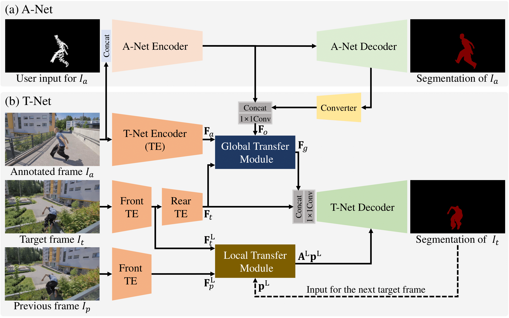

# Interactive Video Object Segmentation Using Global and Local Transfer Modules
#### Yuk Heo, Yeong Jun Koh, Chang-Su Kim


Pytorch implementation lists of [ECCV2020 paper](https://openreview.net/forum?id=bo_lWt_aA) in the page

1. DAVIS2017 evaluation based on the [DAVIS framework](https://interactive.davischallenge.org/)
2. DAVIS2016 real-world evaluation GUI

### Prerequisite
- python 3.6
- pytorch 1.2.0
- [davisinteractive 1.0.4](https://github.com/albertomontesg/davis-interactive)
- [corrlation package](https://github.com/NVIDIA/flownet2-pytorch/tree/master/networks/correlation_package) of [FlowNet2](https://github.com/NVIDIA/flownet2-pytorch)
- numpy, cv2, PtQt5, and other general libraries of python3


### Reference

Please cite our paper if the implementations are useful in your work:
```
@Inproceedings{
Yuk2020IVOS,
title={Interactive Video Object Segmentation Using Global and Local Transfer Modules},
author={Yuk Heo and Yeong Jun Koh and Chang-Su Kim},
booktitle={ECCV},
year={2020},
url={https://openreview.net/forum?id=bo_lWt_aA}
}
```

Our real-world evaluation demo is based on the GUI of [IPNet](https://github.com/seoungwugoh/ivs-demo):
``` 
@Inproceedings{
Oh2019IVOS,
title={Fast User-Guided Video Object Segmentation by Interaction-and-Propagation Networks},
author={Seoung Wug Oh and Joon-Young Lee and Seon Joo Kim},
booktitle={CVPR},
year={2019},
url={https://openaccess.thecvf.com/content_ICCV_2019/papers/Oh_Video_Object_Segmentation_Using_Space-Time_Memory_Networks_ICCV_2019_paper.pdf}
}
```
